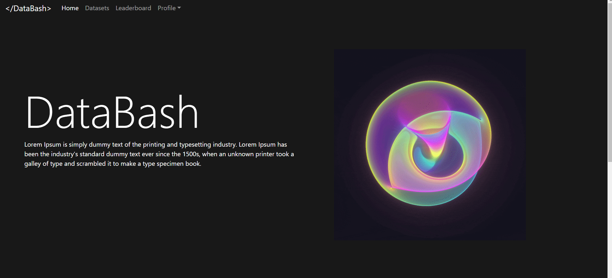

# DataBash

## About

DataBash is a portal for crowdfunded and opensource datasets built together with the whole community. People can post requests for data as well as contribute to other people's datasets. It is an attempt to expand the availability of data to the masses and provide a centralised environment for community based data generation.

1. Fork the repo
2. Clone the github repo onto your machine.
3. Rename the .env.example to .env which should include `DEBUG=True` and SECRET_KEY
4. Go to https://djecrety.ir/, create a secret key and paste it in the .env file
5. Install the pip packages: run `pip install -r requirements.txt`
6. Make migrations: run `python manage.py migrate`
7. Run the django server: `python manage.py runserver`

## Screenshot

